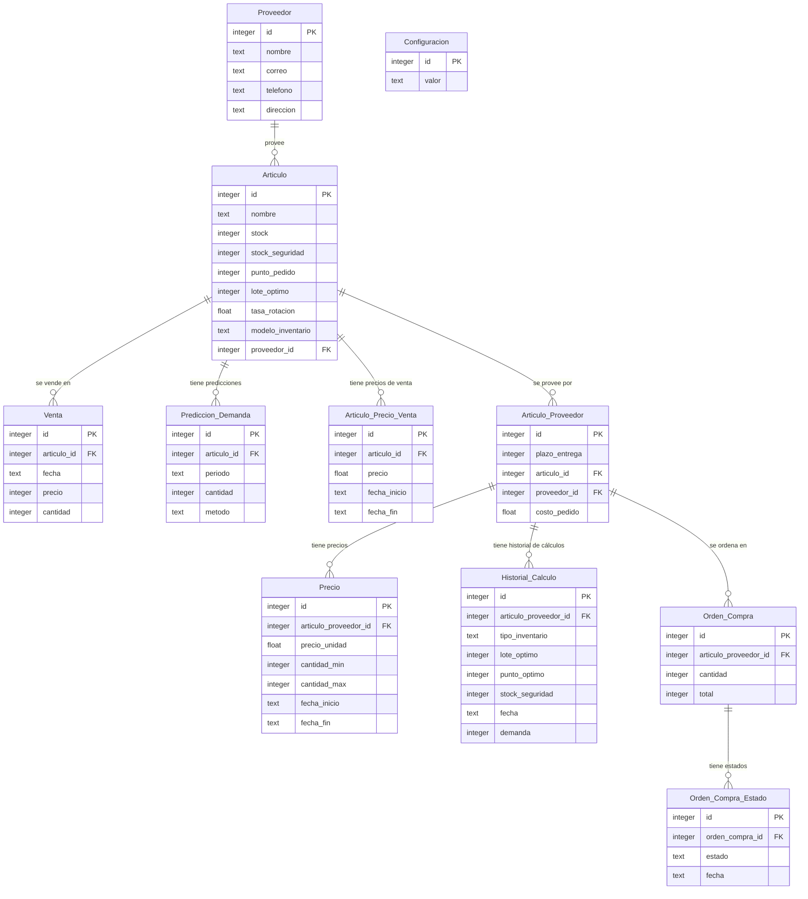

# Gestor de inventario

Este proyecto es un gestor de inventario que permite a los usuarios llevar un control de los productos que tienen en su inventario, así como también permite a los usuarios llevar un control de los productos que han vendido. En el marco de la clase de Investigación operativa, se busca implementar distintos métodos de optimización para mejorar la eficiencia del sistema.

# Tecnologías


# Equipo

- [Antonella Aldao]()
- [Facundo Lucero]()
- [Facundo ]()
- [Ignacio Berridy]()

# Diagrama de clases



## Instrucciones de uso

Primero, clona el repositorio:

```bash
git clone https://github.com/NachoBerridy/Gestion-Inventario.git
```

Instala las dependencias:

```bash
cd Gestion-Inventario
npm install
# or
yarn install
# or
pnpm install
```

Luego, corre el servidor de desarrollo:


```bash
npm run dev
# or
yarn dev
# or
pnpm dev
# or
bun dev
```
